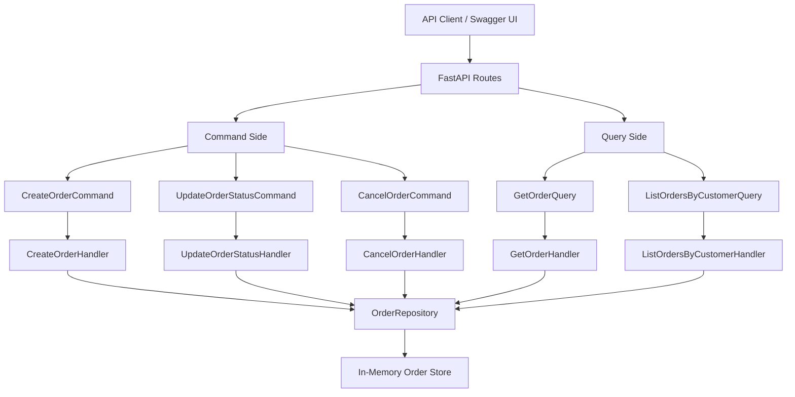
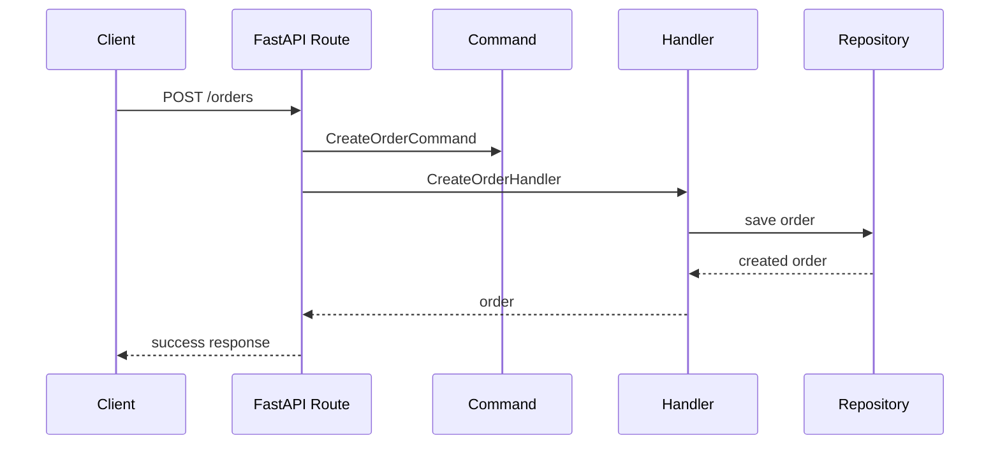
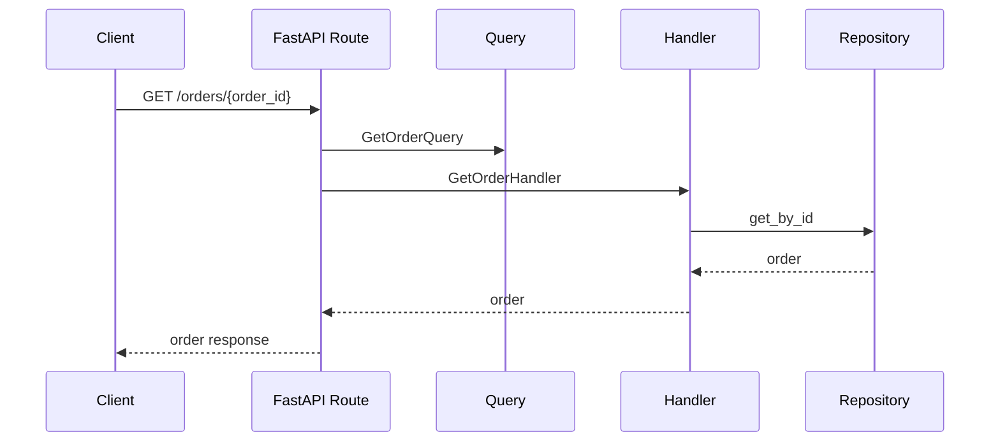

# Order Management CQRS API

A backend project that demonstrates the **CQRS Design Pattern** using **Python** and **FastAPI**.

This project separates write operations from read operations by using:

- **Commands** for actions that change order data
- **Queries** for actions that read order data
- **Handlers** to execute each command or query
- **Repository** to manage order storage

## Features

- Create order
- Update order status
- Cancel order
- Get order by ID
- List orders by customer
- Clear separation between command side and query side

## Tech Stack

- Python
- FastAPI
- Pydantic
- Uvicorn
- CQRS Pattern
- Repository Pattern

## CQRS Flow Diagram



## Request Flow

### Command Flow



### Query Flow



## Project Structure

```text
CQRS_pattern/
|-- commands/
|   |-- cancel_order_command.py
|   |-- cancel_order_handler.py
|   |-- create_order_command.py
|   |-- create_order_handler.py
|   |-- update_order_status_command.py
|   `-- update_order_status_handler.py
|-- models/
|   `-- order.py
|-- queries/
|   |-- get_order_handler.py
|   |-- get_order_query.py
|   |-- list_orders_by_customer_handler.py
|   `-- list_orders_by_customer_query.py
|-- repositories/
|   `-- order_repository.py
|-- main.py
|-- requirements.txt
`-- README.md
```

## API Endpoints

| Method | Endpoint | Purpose | CQRS Side |
| --- | --- | --- | --- |
| `POST` | `/orders` | Create a new order | Command |
| `PATCH` | `/orders/{order_id}/status` | Update order status | Command |
| `POST` | `/orders/{order_id}/cancel` | Cancel an order | Command |
| `GET` | `/orders/{order_id}` | Get order by ID | Query |
| `GET` | `/customers/{customer_id}/orders` | List orders by customer | Query |

## Run the Project

Install dependencies:

```bash
uv pip install -r requirements.txt
```

Start the API:

```bash
uv run uvicorn main:app --reload
```

Open Swagger UI:

```text
http://127.0.0.1:8000/docs
```

## Example Requests

### Create Order

```bash
curl -X POST http://127.0.0.1:8000/orders \
  -H "Content-Type: application/json" \
  -d '{"customer_id": 101, "items": ["Laptop", "Mouse"]}'
```

### Update Order Status

```bash
curl -X PATCH http://127.0.0.1:8000/orders/1/status \
  -H "Content-Type: application/json" \
  -d '{"status": "CONFIRMED"}'
```

### Cancel Order

```bash
curl -X POST http://127.0.0.1:8000/orders/1/cancel
```

### Get Order by ID

```bash
curl http://127.0.0.1:8000/orders/1
```

### List Orders by Customer

```bash
curl http://127.0.0.1:8000/customers/101/orders
```

## Why CQRS?

CQRS separates the responsibility of changing data from reading data. In this project, commands handle business actions such as creating, updating, and cancelling orders, while queries handle read-only operations such as fetching order details.

This improves code organization, makes the system easier to extend, and keeps business logic focused inside dedicated handlers.
