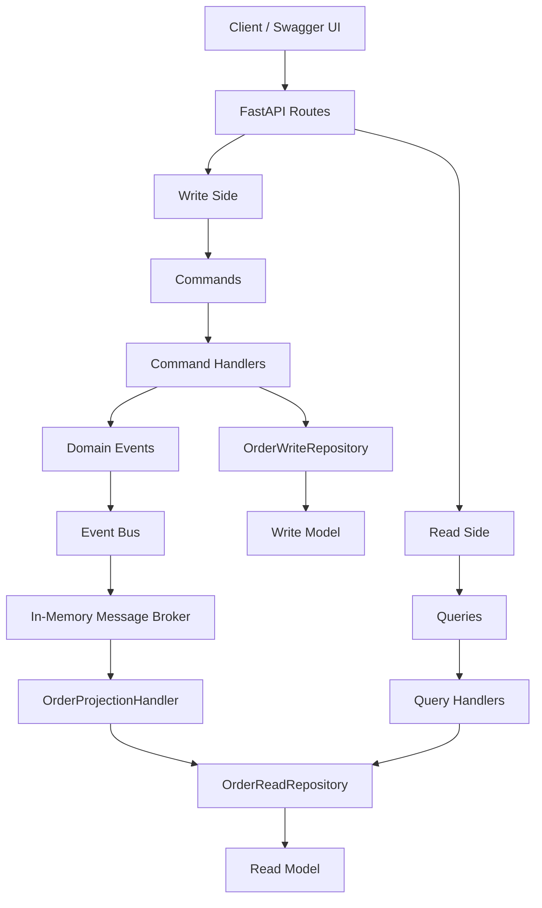
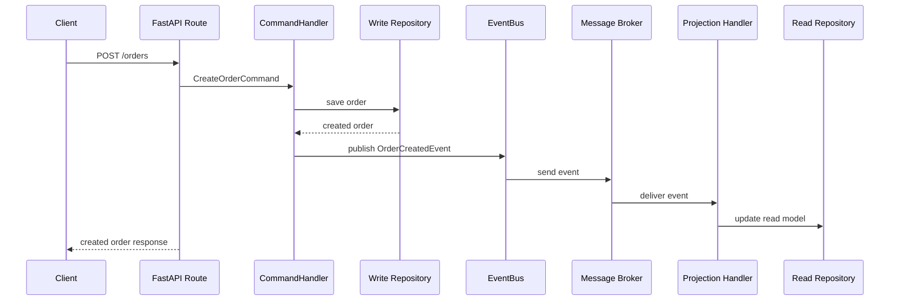

# CQRS + Event-Driven Order Management API

A backend project that demonstrates **CQRS** and **event-driven architecture** using **Python** and **FastAPI**.

This project separates write operations from read operations and connects both sides through an in-memory **Event Bus / Message Broker**.

## Features

- Create order
- Update order status
- Cancel order
- Publish domain events after write operations
- Project events into a separate read model
- Get order by ID from the read side
- List orders by customer from the read side
- Inspect published broker events

## Tech Stack

- Python
- FastAPI
- Pydantic
- Uvicorn
- CQRS Pattern
- Event Bus
- Message Broker
- Projection Handler
- Repository Pattern

## Architecture Flow



## Event Flow



## Events

| Event | Published When |
| --- | --- |
| `OrderCreatedEvent` | A new order is created |
| `OrderStatusUpdatedEvent` | An order status is changed |
| `OrderCancelledEvent` | An order is cancelled |

## Project Structure

```text
CQRS_pattern/
|-- commands/
|   |-- cancel_order_command.py
|   |-- cancel_order_handler.py
|   |-- create_order_command.py
|   |-- create_order_handler.py
|   |-- update_order_status_command.py
|   `-- update_order_status_handler.py
|-- events/
|   `-- order_events.py
|-- infrastructure/
|   |-- event_bus.py
|   `-- message_broker.py
|-- models/
|   `-- order.py
|-- projections/
|   `-- order_projection_handler.py
|-- queries/
|   |-- get_order_handler.py
|   |-- get_order_query.py
|   |-- list_orders_by_customer_handler.py
|   `-- list_orders_by_customer_query.py
|-- repositories/
|   |-- order_read_repository.py
|   `-- order_write_repository.py
|-- main.py
|-- requirements.txt
`-- README.md
```

## API Endpoints

| Method | Endpoint | Purpose | Side |
| --- | --- | --- | --- |
| `POST` | `/orders` | Create a new order | Command |
| `PATCH` | `/orders/{order_id}/status` | Update order status | Command |
| `POST` | `/orders/{order_id}/cancel` | Cancel an order | Command |
| `GET` | `/orders/{order_id}` | Get order by ID | Query |
| `GET` | `/customers/{customer_id}/orders` | List orders by customer | Query |
| `GET` | `/broker/events` | Inspect published events | Eventing |

## Run the Project

Install dependencies:

```bash
uv pip install -r requirements.txt
```

Start the API:

```bash
uv run uvicorn main:app --reload
```

Open Swagger UI:

```text
http://127.0.0.1:8000/docs
```

## Example Requests

### Create Order

```bash
curl -X POST http://127.0.0.1:8000/orders \
  -H "Content-Type: application/json" \
  -d '{"customer_id": 101, "items": ["Laptop", "Mouse"]}'
```

This writes to the write repository and publishes `OrderCreatedEvent`.

### Update Order Status

```bash
curl -X PATCH http://127.0.0.1:8000/orders/1/status \
  -H "Content-Type: application/json" \
  -d '{"status": "CONFIRMED"}'
```

This updates the write model and publishes `OrderStatusUpdatedEvent`.

### Cancel Order

```bash
curl -X POST http://127.0.0.1:8000/orders/1/cancel
```

This updates the write model and publishes `OrderCancelledEvent`.

### Get Order by ID

```bash
curl http://127.0.0.1:8000/orders/1
```

This reads from the projected read model.

### List Orders by Customer

```bash
curl http://127.0.0.1:8000/customers/101/orders
```

This reads from the projected read model.

### Inspect Published Events

```bash
curl http://127.0.0.1:8000/broker/events
```

Example response:

```json
[
  {
    "topic": "order-events",
    "event_type": "OrderCreatedEvent",
    "payload": {
      "order_id": 1,
      "customer_id": 101,
      "items": ["Laptop", "Mouse"],
      "status": "CREATED"
    }
  }
]
```

## Why Add an Event Bus?

The event bus allows command handlers to publish business events without directly knowing who will consume them. The message broker stores and delivers those events to subscribers.

In this project, the `OrderProjectionHandler` subscribes to order events and updates the read model. This shows how a real system could use Kafka, RabbitMQ, or Redis Streams to keep write and read models synchronized.
